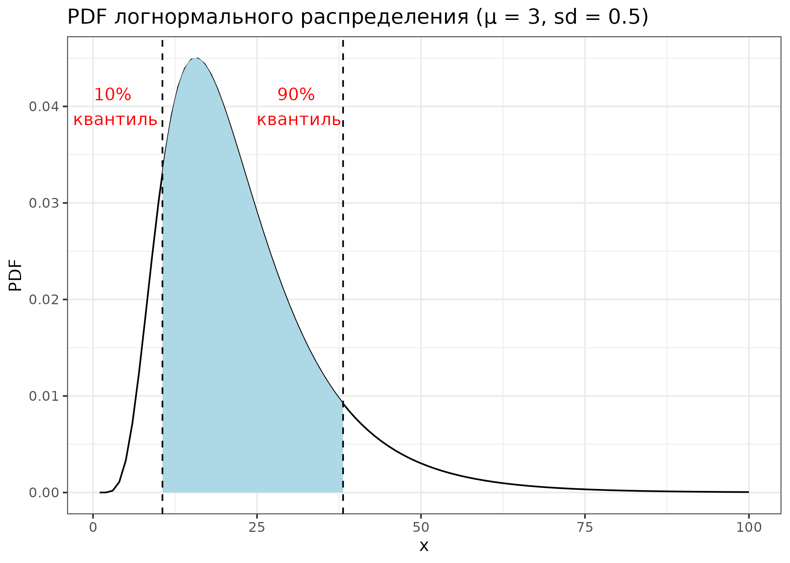
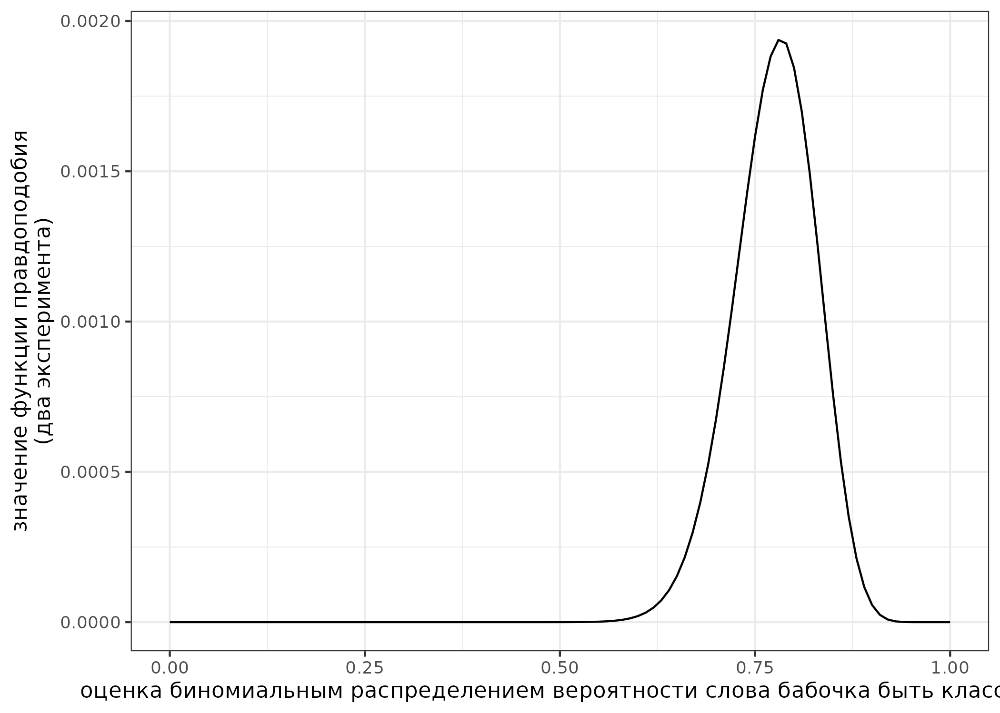
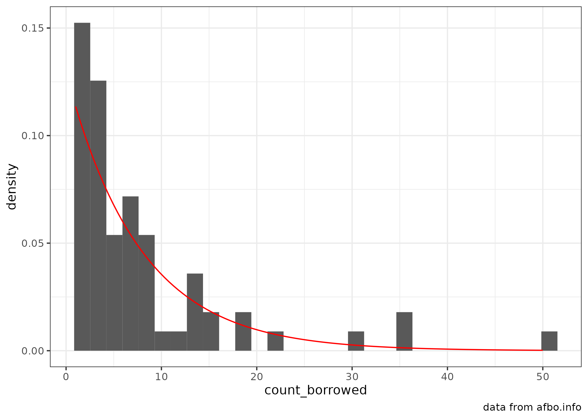

```{r, message=FALSE}
library(tidyverse)
```

Это [rmarkdown](https://rmarkdown.rstudio.com/) документ. Чтобы его скомпилировать, можно нажать в RStudio кнопку Knit. Вставьте ваше имя в заголовок, а код в соответствующие фрагменты, выделенные знаками `.

## task 1.1

Дан график логнормального распределения с лог-средним 3 и лог-стандартным отклонением 0.5. Посчитайте закрашенную площадь под кривой. В ответе выведите в консоль значение с точностью до трех знаков после запятой.



```{r}
# Ответ на задание 1.1
```

## task 1.2

В работе [Moroz, Verhees 2019] исследовалась вариативность классовой атрибуции в андийском языке и выяснилось, что 9 носителей относят слово *бабочка* к классу *b* и 7 носиителей относят слово к классу *r*. В новой итерации эксперимента 38 носителей отнесли слово *бабочка*  к классу *b* и 6 носителей отнесли слово к классу *r*. Визуализируйте функцию правдоподобия и посчитайте какой из вариантов, заданный функцией `seq(0, 1, by = 0.01)`, имеет наибольшее значение функции правдоподобия.



```{r}
# Ответ на задание 1.2
```

## task 1.3

[В датасете](https://afbo.info/pairs.csv?sEcho=1&iSortingCols=1&iSortCol_0=0&sSortDir_0=asc) собраны данные из базы данных [AfBo](https://afbo.info/). В этой базе данных собрана информация о том, какие языки из каких языков заимствовавали суффиксы. Скачайте данные, отфильтруйте ниболее достоверные значения (т. е. такие, чтобы в переменной `reliability` было значение `high`), воспользуйтесь методом максимального правдоподобия, чтобы оценить параметры экспоненциального распределения (смотрите справку командой `?dexp`), описывающего распределение количества заимствованных суфиксов (переменная `count_borrowed`), а потом визуализируйте данные и найденное распределение.



```{r, message=FALSE}
library(fitdistrplus)
```

```{r}
# Ответ на задание 1.3
```

## task 1.4

Место для рефлексии по поводу ответов. Заполняется после того, как присланы ответы на задания до 07.02.2022 23:59. Это оцениваемое задание.
